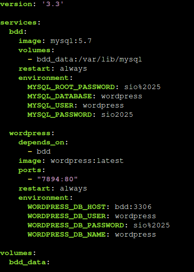
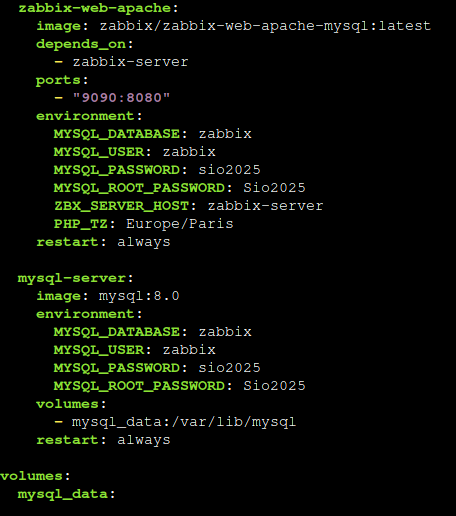
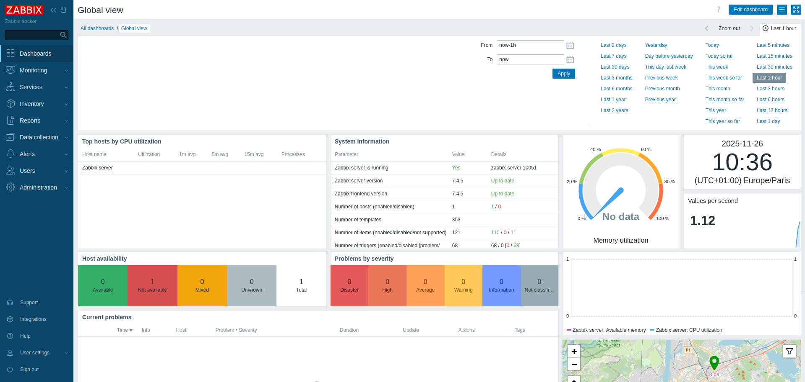

# TP-BILAN

- Installer docker et docker-compose à partir d'un script bash
- Installer Wordpress et Zabbix en utilisant Docker (exploitation du maping de ports)
- Push le projet sur Github

---

## Table des matières

1. [Script d'Installation de Docker](#1-script-d'installation-de-docker)
2. [Installation des Applications Conteneurisées (Docker Compose)](#2-installation-des-applications-conteneurisées-docker-compose)\
    2.1. [Installation de WordPress](#21-installation-de-wordpress)\
    2.2. [Installation de Zabbix](#22-installation-de-zabbix)

---

## 1. Script d'Installation de Docker

Un script Bash nommé `install_docker.sh` est utilisé pour automatiser l'installation de __Docker Engine__ et de __Docker Compose__ sur la VM, en utilisant les dépôts officiels de Docker.

### Contenu du script `install_docker.sh`

```bash
#!/bin/bash

echo "=== Mise a jour du systeme ==="
apt update && apt upgrade -y

echo "=== Installation des dependances necessaires ==="
apt install ca-certificates curl gnupg lsb-release dpkg -y

echo "=== Ajout du depot Docker ==="
wget https://download.docker.com/linux/debian | tee /etc/apt/sources.list.d/docker.list > /dev/null

echo "=== Mise a jour de la liste des paquets ==="
apt update -y

echo "=== Installation de Docker + Docker-compose ==="
apt install docker docker-compose -y

echo "=== Activation et demarrage de Docker ==="
systemctl enable docker
systemctl start docker

echo "=== Verification de l'installation ==="
docker --version
docker compose version

echo "=== Installation terminee ! ==="
```

### Exécution du script :

```bash
chmod +x install_docker.sh
./install_docker.sh
```
---

## 2. Installation des Applications Conteneurisées (Docker Compose)

Pour définir et exécuter les services, on utilise __docker-compose__.\
La création de __conteneurs__ se fait grâce à un fichier `docker-compose.yml` où l'on renseigne les instructions nécessaires au déploiement.

Créer un dossier pour chaque __service__ (ex: Wordpress_docker et zabbix_docker) et créer dans celui-ci le fichier `docker-compose.yml`.

Le __Mapping de Ports__ est utilisé pour le fonctionnement des applications, mais comment cela fonctionne ?
- Le mapping de ports est une fonctionnalité qui permet à un service fonctionnant à l'intérieur d'un réseau privé (conteneur, VM) d'être accessible depuis l'extérieur, c'est-à-dire depuis une machine hôte ou Internet.
- Il associe un port d'écoute d'une machine hôte à un port spécifique d'un environnement réseau isolé.

### 2.1. Installation de WordPress

Le fichier `docker-compose.yml` contient deux blocs : le serveur web __WordPress__(wordpress) et sa base de données __MariaDB/MySQL__ (db).
- __Mapping de Ports :__ Le service WordPress sera mappé sur le port externe `7894` pour l'accès web. Il utilise le port `80` pour le protocole HTTP.



Lancer le conteneur avec la commande `docker-compose up -d`, attendre la fin de l'installation.\
Après cela, se rendre sur une page web et taper : `http://IP_du_serveur:7894`. Une interface __Wordpress__ apparait et l'installation est désormais disponible.

\


### 2.2. Installation de Zabbix

Ici, le fichier `docker-compose.yml` contient trois blocs : __zabbix-server__ (serveur), __zabbix-web-apache__ (interface web) et __mysql-server__ (base de donnée).
- __Mapping de Ports :__ Le service WordPress sera mappé sur le port externe `9090` pour l'accès web. Il utilise le port `8080` (port alternatif au port 80) pour le protocole HTTP.

\


La méthode d'installation reste la même que pour __Wordpress__.\
Après cela, se rendre sur une page web et taper : `http://IP_du_serveur:9090`. Une interface __Zabbix__ apparait et il est désormais possible de se connecter et d'y accéder.



---

## 3. Push des travaux avec Git

On utilise la solution __Git__ pour pousser les travaux sur __Github__, cela permet de sauvegarder les dossiers, fichiers de configurations, etc ...

### 3.1. Créer et copier la clé SSH

Il faut avant tout créer une __clé SSH__ et la copier sur Github pour pouvoir communiquer sans problème.\
Création de la clé :
```bash
sshkeygen -t ed25519
```
Voir la clé publique :
```bash
cat /root/.ssh/id_ed25519.pub
```
Sur Github, aller dans les _Settings_ > _SSH and GPG keys_ puis copier la clé en l'ajoutant.

### 3.2. Créer le dépôt distant (Repository GitHub)

Avant de commencer, créer un nouveau dépôt vide sur le site web de GitHub. Donnez-lui un nom pertinent, qui n'est pas ambigu.

### 3.3. Initialisation du dépôt local (sur la VM)

Accéder au dossier contenant les fichiers (`install_docker.sh`, `doc.yml`, etc.) et exécuter la commande d'initialisation :

```bash
git init
```

### 3.4. Ajouter les fichiers au suivi (Staging)

L'étape __add__ prépare les fichiers pour le commit.\
Ajouter les fichiers du dossier qui doivent être envoyés sur __Github__ (ils passeront en vert dans `git status`).
  ```bash
  git add nom_des_fichiers

    OU (pour ajouter tous les fichiers)

git add .
```

### 3.5. Vérification de l'état

```bash
git status
```
La commande montre quels fichiers sont nouveaux, modifiés ou prêts à être enregistrés.

### 3.6. Enregistrer les modifications

Le __commit__ est l'étape où les changements sont enregistrés de manière permanente dans l'historique local.\
Enregistrer les fichiers ajoutés avec un message descriptif.
```bash
git commit -m "description_du_commit"
```

### 3.7. Lier le dépôt local au dépôt distant

Pour pouvoir communiquer avec __Github__, il faut dire à __Git__ où se trouve le dépôt que vous avez créé sur GitHub.\
Lier le dépôt local à l'URL distante
```bash
git remote add origin git@github.com:user_github/nom_du_dépot.git
```

### 3.8. Publier le travail

Le __push__ envoie les commits enregistrés sur la machine locale vers le dépôt distant (GitHub). Les commits sont __push__ vers la branche principale (`main`).
```bash
git push -u origin main
```

### 3.9. Vérification de l'historique

La commande `git log` affiche l'historique des commits. Elle permet de confirmer que le dernier commit est bien enregistré localement (et après le push, sur le serveur distant).
```bash
git log
```
